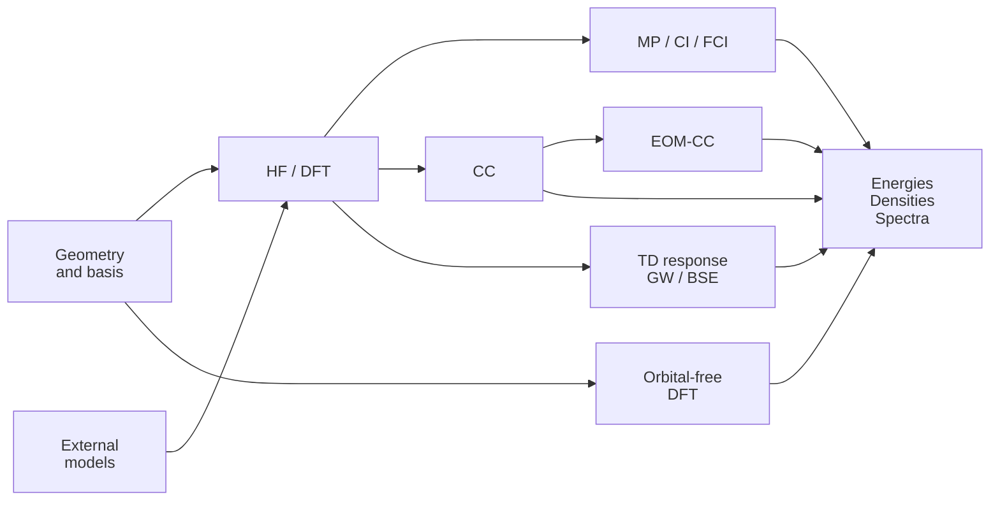

# GradSCF

**Differentiable electronic structure in JAX.**

GradSCF is a Python framework for molecular and periodic electronic-structure
calculations, response theory, and learning within self-consistent calculations.
It combines HF/DFT with MP, CI/FCI, CC, EOM-CC, GW, and BSE. External energy
functionals and neural Gaussian basis models connect to physical equations
through JAX automatic differentiation and shared implicit-response solvers.

[Installation](#installation) · [Quick start](#quick-start) ·
[Methods](#supported-methods) · [Differentiation](#differentiation) ·
[Learning](#learning-with-gradscf) · [Examples](#examples) · [Citation](#citation)

## Highlights

- **Ground states and correlation.** Molecular and periodic HF/DFT,
  orbital-free DFT, and molecular MP, CI/FCI, and CC/QCI calculations.
- **Excitations and spectra.** TDHF/TDDFT, EOM excitation/ionization/attachment
  energies, GW quasiparticles, BSE optical response, and vibrational coupling.
- **Differentiable physical solutions.** Array kernels expose parameter
  derivatives; converged electronic states and spectral problems use shared
  response rules with explicit validity conditions.
- **External models in self-consistency.** User-defined features and networks
  supply XC or kinetic energies; GradSCF computes potentials and response
  actions. Neural basis models optimize Gaussian contractions.
- **Two Python interfaces.** Short calculation objects for interactive use,
  and functional array APIs for `jax.jit`, `jax.grad`, and custom objectives.



Each method has its own reference, representation, and derivative contract;
the guides below identify supported combinations. EOM uses a CC reference.

## Installation

Install from source on Linux or macOS. The package declares Python 3.10+;
repository tests use Python 3.11+. Native CPU integrals require CMake 3.20+,
a C99/C++17 compiler, and a BLAS library (Accelerate on macOS).

```bash
git clone --branch release/v1.0.0 https://github.com/STOKES-DOT/GradSCF.git
cd GradSCF
python -m venv .venv
source .venv/bin/activate
python -m pip install -e .
python -m gradscf.integrals._native.build
JAX_PLATFORMS=cpu JAX_ENABLE_X64=1 python -c \
  "from gradscf import gto, scf; mf = scf.RHF(gto.M(atom='H 0 0 0; H 0 0 .74', basis='sto-3g')).run(); assert mf.converged; print(float(mf.e_tot))"
```

Native sources are bundled; the build downloads no upstream source. Rebuild
after changing JAX versions. See the [native build guide](src/gradscf/integrals/_native/README.md).

| Optional installation | Purpose |
| --- | --- |
| `python -m pip install -e ".[upstreams]"` | `jax-xc` for supported conventional XC functionals |
| `python -m pip install -e ".[dev,comparison-tests]"` | pytest and independent PySCF comparisons |
| `python -m pip install -e ".[nnao]"` | Pinned MACE-JAX dependency for neural basis models |
| `python -m pip install -e ".[reproducibility]"` | Plotting, HDF5, SciPy, and evaluation tools |

PySCF is a comparison/optional-bridge dependency, not the native integral or
post-HF numerical runtime. Native integrals execute on CPU; downstream JAX
device support does not establish GPU coverage for every calculation.

## Quick start

Run these independent snippets after installation and the native build. Set
`JAX_PLATFORMS=cpu` before launching Python for CPU execution. Enable float64
before constructing arrays. Coordinates below are Angstrom; energies are Hartree.

### HF and MP2

```python
import jax
jax.config.update("jax_enable_x64", True)
from gradscf import gto, scf, mp

mol = gto.M(atom="H 0 0 0; H 0 0 .74", basis="sto-3g")
mf = scf.RHF(mol, conv_tol=1e-12).run()
assert mf.converged
pt = mp.MP2(mf).run()
print("HF:", float(mf.e_tot), "MP2:", float(pt.e_tot))
```

Use `scf.UHF` or `scf.ROHF` for their respective open-shell references.
MP2/MP3 and generic MPn accept real canonical RHF/UHF.
CI and CC have additional ROHF-based paths.

### DFT and excitation energies

This snippet needs the `[upstreams]` extra. `tdscf.TDA` and `tdscf.TDDFT`
provide excitation energies and transition properties for supported references
and XC kernels. An HF reference selects TDHF response.

```python
import jax
jax.config.update("jax_enable_x64", True)
from gradscf import gto, dft, tdscf

mol = gto.M(atom="O 0 0 0; H 0 .75 .58; H 0 -.75 .58", basis="sto-3g")
mf = dft.RKS(mol, xc="pbe", grids_level=1, conv_tol=1e-10).run()
assert mf.converged
td = tdscf.TDA(mf, nstates=3)
td.kernel()
assert td.converged
print("Excitation energies / Ha:", td.e)
```

### Differentiate a correlated energy

A dimensionless parameter scales the two-electron MO integrals at a fixed
orbital frame. The derivative includes converged CC amplitude response; HF
orbital and nuclear-coordinate response are outside this example.

```python
import jax
jax.config.update("jax_enable_x64", True)
from gradscf import gto, scf, cc
from gradscf.scf.reference import reference_from_source

mf = scf.RHF(gto.M(atom="H 0 0 0; H 0 0 .74", basis="sto-3g")).run()
ref = reference_from_source(mf)
config = cc.CCConfig(conv_tol=1e-12, residual_tol=1e-11)

def energy(coupling):
    result = cc.run_cc(ref.h1, coupling * ref.eri, nocc=ref.nocc,
                       nuclear_repulsion=ref.nuclear_repulsion, config=config)
    return result.total_energy

value, derivative = jax.jit(jax.value_and_grad(energy))(1.0)
print("Energy / Ha:", float(value), "dE/dcoupling / Ha:", float(derivative))
```

For a complete implicit-HF-to-MP parameter derivative, see
[the MP gradient example](examples/mp/implicit_gradient.py).

### Train an external energy functional

This pure-JAX network adds a learned correction to Dirac exchange.
Features and architecture are defined outside GradSCF; the trainer reconverges
the electronic state and differentiates its fixed point.

```python
import jax
import jax.numpy as jnp
jax.config.update("jax_enable_x64", True)
from gradscf import gto, scf, dft, fci, training

def inputs(state):
    return {"rho": state.rho, "weights": state.weights}

def energy(params, x):
    rho = jnp.maximum(x["rho"], 1e-18)
    exchange = -.75 * (3 / jnp.pi)**(1 / 3) * rho**(4 / 3)
    correction = .01 * rho * jnp.tanh(params["w"] * jnp.log1p(rho))
    return jnp.sum(x["weights"] * (exchange + correction))

functional = dft.Functional(input_fn=inputs, energy_fn=energy)
mf = scf.RHF(gto.M(atom="H 0 0 0; H 0 0 .74", basis="sto-3g"),
             grids_level=0, conv_tol=1e-12).run()
target = float(fci.FCI(mf, solver="dense").run().e_tot)
trainer = training.Trainer(functional, params={"w": jnp.array(0.)})
trainer.mode = "implicit"
trainer.loss = {"energy": {"mse": 1., "mae": 1.}}
trainer.learning_rate = .001
trainer.run([training.Sample(mf, energy=target)], steps=3)
print(trainer.history["loss"])
```

This demonstrates the interface, not a transferable XC model. See the
[external Flax example](examples/training/external_functional.py),
[four-layer density-matrix MLP](examples/training/density_matrix_mlp.py), and
[100-step H2/FCI comparison](examples/training/h2_fci_training.py).

## Supported methods

Forward availability, derivative coverage, and physical accuracy are separate.

| Family | Available calculations | Reference / scope and guide |
| --- | --- | --- |
| Molecular HF/DFT | RHF/UHF/ROHF/GHF; RKS/UKS/ROKS/GKS; UHF/UKS stability | [SCF](src/gradscf/scf), [DFT](src/gradscf/dft); closed-shell HF uses `scf.RHF` |
| Periodic HF/DFT | Gamma/k-point calculations, GTH, FFT density fitting, bands | [Periodic modules](src/gradscf/pbc); method-specific periodic contracts |
| MP | MP2/MP3 and order-driven MPn; frozen orbitals, E2 spin components | [MP](src/gradscf/mp/README.md), [Taylor series](src/gradscf/mp/SERIES.md); real canonical RHF/UHF, capacity-limited high-order engine |
| CI | Singlet/triplet CIS, singlet CIS(D), spin-conserving UCIS, rank-truncated CI | [CI](src/gradscf/ci/README.md); real RHF/UHF/ROHF determinant spaces |
| FCI | Complete occupation-string spaces, core/active selection, RDMs, transition RDMs, spin diagnostics | [FCI](src/gradscf/fci/README.md); real common spatial orbitals, integer spin populations |
| CC/QCI | CCS/CCD/CCSD/CC2/LCCD/LCCSD, QCISD, CCSD(T)/QCISD(T), Lambda, 1/2-RDMs | [CC](src/gradscf/cc/README.md); restricted models and UCCSD/UCCD; model-specific properties |
| EOM-CCSD | EE singlet, IP/EA doublet energies, left/right states, first-order response | [EOM](src/gradscf/cc/eom/README.md); real restricted CCSD reference |
| TDHF/TDDFT | TDA/full response, transition properties and spectra; periodic q=0 response | [Molecular facade](src/gradscf/tdscf), [periodic response](src/gradscf/pbc/tdscf.py) |
| GW | Molecular G0W0-CD, evGW0, evGW, restricted qsGW/matrix Matsubara scGW; Gamma/k-point GW | [GW](src/gradscf/gw), [scGW](src/gradscf/gw/SCGW.md), [periodic GW](src/gradscf/gw/pbc) |
| BSE | Static TDA/full optics, singlet/triplet and unrestricted spin-conserving sectors | [BSE](src/gradscf/bse/README.md); molecular reference and screening conventions |
| OFDFT | Molecular/periodic Gaussian amplitudes and FFT grids; TF, vW, TF+vW, WT, WGC99, external KEDFs | [OFDFT](src/gradscf/ofdft/README.md); unpolarized density, WT/WGC periodic only |
| Vibrational coupling | Fan/Debye–Waller self-energies, spectra, exciton–vibration optics, finite-space vibronic Hamiltonians | [GW EP](src/gradscf/gw/ep_coupling/README.md), [BSE EP](src/gradscf/bse/ep_coupling/README.md); fixed bath, BSE projection restricted TDA |

Canonical real UHF CCSD(T), UCC Lambda and spin-resolved densities are available.
The [semicanonical triples option](src/gradscf/cc/SEMICANONICAL.md) supports its
specified noncanonical references through a tensor resolvent. ROHF-based UCCSD
uses unrestricted amplitudes on common orbitals, not a separate spin-adapted
ROCCSD formulation. See [open-shell scope](src/gradscf/cc/OPEN_SHELL.md).

FCI active spaces provide a foundation for future multireference drivers;
CASSCF orbital optimization is not implemented. Fixed-phonon GW/BSE coupling
has no self-consistent phonon feedback; Matsubara scGW has no analytic continuation.

## Differentiation

Choose the variable and observable before selecting a derivative path:

| Target | Numerical response | Contract |
| --- | --- | --- |
| SCF energy/state | Explicit JAX computation or implicit stationarity/fixed-point response | Convergence, occupations, integral/XC derivatives |
| MP energy/amplitudes | Specialized JAX kernels or residual-driven Taylor lifting | Canonical inputs, physical denominators; upstream HF response |
| CI/FCI/TDA states | Shared isolated-root response; FCI also exposes complete-subspace response | Coefficient objectives need an eigenvector response mode |
| CC energy/amplitudes | Shared nonlinear-root response | Converged amplitudes and checked adjoint solves |
| EOM energies | First-order non-Hermitian left/right energy response | Supported isolated roots; returned vectors are forward diagnostics with stopped AD |
| GW roots/self-consistency | Implicit QP roots and opt-in molecular outer response | [GW contracts](src/gradscf/gw/OUTER_RESPONSE.md); method/spectral-gap restrictions |
| OFDFT density/energy | Explicit iterates or constrained implicit stationarity | Particle-number constraint, functional derivatives, resolved solution |
| Geometry/basis parameters | Integral rules composed with electronic response | Operator, layout, parameter and derivative-order coverage |

Internal degeneracy can permit differentiable **complete-subspace projectors
and energy sums** when the selected space is separated from excluded states.
A numbered root or arbitrary eigenvector need not have a unique derivative.
See [spectral response](src/gradscf/solvers/DEGENERACY.md).

Calculation objects validate eager inputs; use array kernels inside
`jax.jit`/`jax.grad`, with topology, occupations and configuration static.
Check convergence, residuals, denominators and validity flags.
Higher derivatives are supported on specifically validated paths.

Full nuclear derivatives require electronic response and integral/grid/XC
derivatives. Native full integrals have first/second geometry rules for the
documented operators; packed production, auxiliary integrals and direct J/K
parameter derivatives have different coverage. The generic
`mf.nuc_grad_method().kernel()` remains disabled. See
[native contracts](src/gradscf/integrals/_native/README.md) and the
[force-supervision example](examples/train_neural_scf_forces.py).

## Learning with GradSCF

**External XC.** `dft.Functional(input_fn, energy_fn, init_fn=...)` connects
external features and JAX/Flax/Haiku networks. `DensityInputs` exposes the
current density matrix, grid density and supported derivatives, kinetic-energy
density, and fixed geometry/AO data. Features are rebuilt from each trial SCF
density. The callback returns a real scalar XC energy in Hartree, including
its baseline. GradSCF differentiates the whole feature-to-energy graph for
the AO potential and Hessian-vector response. See
[functional contracts](src/gradscf/dft/FUNCTIONAL.md).

`training.Sample`/`training.Trainer` are shared framework APIs;
[model.neural_xc](src/gradscf/model/neural_xc) is a separate concrete model.

| Mode | Forward and derivative |
| --- | --- |
| `fixed_density` | Evaluate the functional on the supplied fixed state |
| `explicit` | Run and differentiate the existing JAX SCF computation |
| `implicit` | Run SCF and differentiate its fixed-point condition |

`explicit` is the public name; SCF uses `lax.scan`, not manual expansion
of iteration blocks. The [training guide](src/gradscf/training/README.md)
defines labels, MSE/MAE losses and update rejection. Samples capture prepared
states; reconstruct them after changing the source. External callbacks must
support the derivative order and physical inputs required by their objective.

**Neural basis sets.** [NNAO](src/gradscf/model/nnao/NNAO.md) maps MACE outputs
to normalized Gaussian contractions. Fixed-primitive direct J/K and RI/DF
paths support self-consistent contraction optimization. See the
[molecular tool](tools/optimize_methane_nnao.py),
[pilot validator](tools/validate_nnao_pilot.py), and
[shared trainer](tools/train_nnao_pilot.py).
Single-geometry or training-set optimization does not establish transferability.

**Orbital-free learning.** External KEDF callbacks receive density and
representation features; their energy supplies potential and response.
See [neural kinetic energy](examples/ofdft/neural_kinetic.py).
Additional dispersion models live in [model.neural_d](src/gradscf/model/neural_d).

## Numerical infrastructure and memory

[gradscf.solvers](src/gradscf/solvers/README.md) owns Hermitian/non-Hermitian
diagonalization, linear solves, nonlinear iteration and their derivative rules.
Methods supply Hamiltonian actions, residuals and physical convergence conditions.

The [integral layer](src/gradscf/integrals/COMPRESSED.md) provides native CPU
and JAX reference paths, exact s4/s8 storage, shell-direct J/K and auxiliary RI/DF.

- Packing is exact; direct J/K avoids a stored four-index tensor.
- RI/DF introduces an auxiliary-basis approximation. DF-MP2 retains
  occupied–virtual factors and streams slices; `with_t2=False` omits doubles output.
- MP3 and current CI/CC paths can expand DF inputs into full MO tensors.
  Accepting DF input is not a DF contraction algorithm.
- FCI transforms only active orbitals after core folding. BSE offers
  matrix-free Hamiltonian/screening actions with documented solver options.

Derivative support is parameter- and layout-specific; fixed-primitive
contraction training does not imply native exponent/auxiliary-integral AD.
Storage bounds and compile estimates are distinct from measured peak memory.

## Examples

| Task | Entry points |
| --- | --- |
| Correlated ground states | [MP2/MP3](examples/mp/molecular.py), [MP2–MP6 series](examples/mp/taylor_series.py), [water MP2–MP8 comparison](examples/mp/compare_water_pyscf.py), [CI](examples/ci/restricted_ci.py), [CC](examples/cc/restricted_ground.py), [open-shell properties](examples/cc/open_shell_properties.py) |
| FCI/active spaces | [Ground state](examples/fci/ground_state.py), [core/active selection](examples/fci/active_space.py) |
| EOM excitation/ionization/attachment | [EE/IP/EA](examples/cc/eom_ccsd.py), [response](examples/cc/eom_response.py) |
| GW/BSE spectra | [scGW](examples/scgw_matsubara_h2.py), [implicit GW](examples/gw/implicit_response.py), [molecular BSE](examples/bse/molecular_spectrum.py), [unrestricted BSE](examples/bse/oh_unrestricted.py) |
| Vibrational spectral effects | [Fixed-phonon scGW](examples/gw/fixed_phonon_scgw.py), [water BSE–vibration](examples/bse/water_ep_coupling.py) |
| Orbital localization/animation | [Ethylene Boys](examples/ethylene_boys.py), [BODIPY](examples/bodipy_boys.md), [rotation animation](examples/animate_bodipy_boys_rotation.py) |
| Wavefunction/basis derivatives | [CIS probes](examples/ci/cis_h2o_gradients.py), [implicit HF → MP](examples/mp/implicit_gradient.py), [counterpoise](examples/basis/README.md) |
| External-model training | [External functional](examples/training/external_functional.py), [density-matrix MLP](examples/training/density_matrix_mlp.py), [H2/FCI modes](examples/training/h2_fci_training.py) |
| OFDFT | [Molecular](examples/ofdft/molecular.py), [periodic](examples/ofdft/periodic.py), [DFTpy comparison](examples/ofdft/compare_dftpy.py), [WGC scope/results](examples/ofdft/WGC_REPRODUCTION.md) |
| Periodic methods/solvers | [Bands](examples/periodic_h2.py), [shared solvers](examples/shared_solvers.py), [degenerate subspace](examples/degenerate_subspace.py) |

Comparison scripts and literature-derived illustrations are identified in
their headers/guides. Follow instructions for optional dependencies, cached
inputs and preceding calculations.

## Validation and current scope

Validation uses independent software/Hamiltonians, reconverged finite differences,
residuals, normalization, symmetry and conservation checks. Systems, basis/XC,
units, tolerances, backend and code context are recorded in
[MP](src/gradscf/mp/VALIDATION.md), [CI](src/gradscf/ci/VALIDATION.md),
[FCI](src/gradscf/fci/VALIDATION.md), [CC](src/gradscf/cc/VALIDATION.md),
[EOM](src/gradscf/cc/eom/MOLECULAR_VALIDATION.md),
[solver](src/gradscf/solvers/VALIDATION.md), and
[OFDFT/WGC](examples/ofdft/WGC_REPRODUCTION.md) reports.

These are scoped records, not a whole-project test counter. CPU/float64
comparisons do not establish GPU coverage; finite-basis agreement does not
establish model accuracy. Performance comparisons need matching workloads,
settings, compilation/warmup policy and timed regions.

With test dependencies and native integrals available:

```bash
JAX_PLATFORMS=cpu JAX_ENABLE_X64=1 python -m pytest -q -ra tests/mp
JAX_PLATFORMS=cpu JAX_ENABLE_X64=1 python -m pytest -q -ra tests/solvers tests/ci tests/fci tests/cc
```

Use `python -m pytest -q -ra` for the full suite and inspect dependency skips.
Reference/property/derivative limits are part of each method's contract.

## Documentation and contributing

Start with [the public API](API.md), [import migration table](API_MIGRATION.csv)
and [migration guide](MIGRATION.md). Method guides contain equations, derivative
contracts, references and validation; [CHANGELOG.md](CHANGELOG.md) records changes.
Use short domain imports for calculation objects and owning modules for advanced arrays.

Report bugs through [GitHub Issues](https://github.com/STOKES-DOT/GradSCF/issues)
with a minimal example, commit/version, device/backend, dtype, geometry/units,
basis/XC, convergence controls and reference result. Contributions should keep
physical equations separate from shared solvers, add focused numerical regressions,
and preserve upstream notices.

## Citation

Identify the repository and commit/version used in published calculations.
Cite the methods and upstream software relevant to your calculation; references
and attribution are maintained in
[MP](src/gradscf/mp/REFERENCES.md), [CI](src/gradscf/ci/REFERENCES.md),
[FCI](src/gradscf/fci/REFERENCES.md), [CC](src/gradscf/cc/REFERENCES.md),
[BSE](src/gradscf/bse/REFERENCES.md), and [GW](src/gradscf/gw/__init__.py).

<a id="code-origins"></a>

## License and acknowledgments

Original GradSCF code uses the [MIT license](LICENSE). Foundational DFT/TDDFT
code originates from [GradTDDFT](https://github.com/STOKES-DOT/GradTDDFT).
Adapted/vendored components retain their own notices and licenses:
[PySCF CC contractions](src/gradscf/cc/NOTICE.md),
[native PySCF/libcint](src/gradscf/integrals/_native/README.md),
[OFDFT/libKEDF](src/gradscf/ofdft/LICENSE.libKEDF), and
[MACE-JAX provenance](src/gradscf/model/nnao/UPSTREAM.json).
