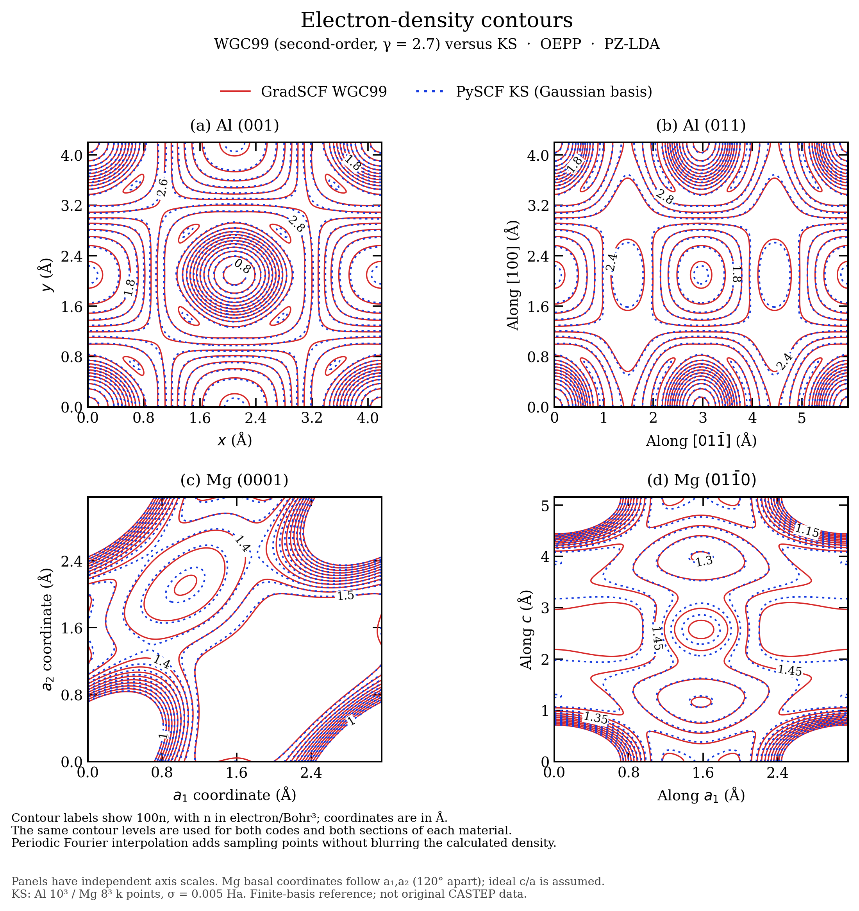
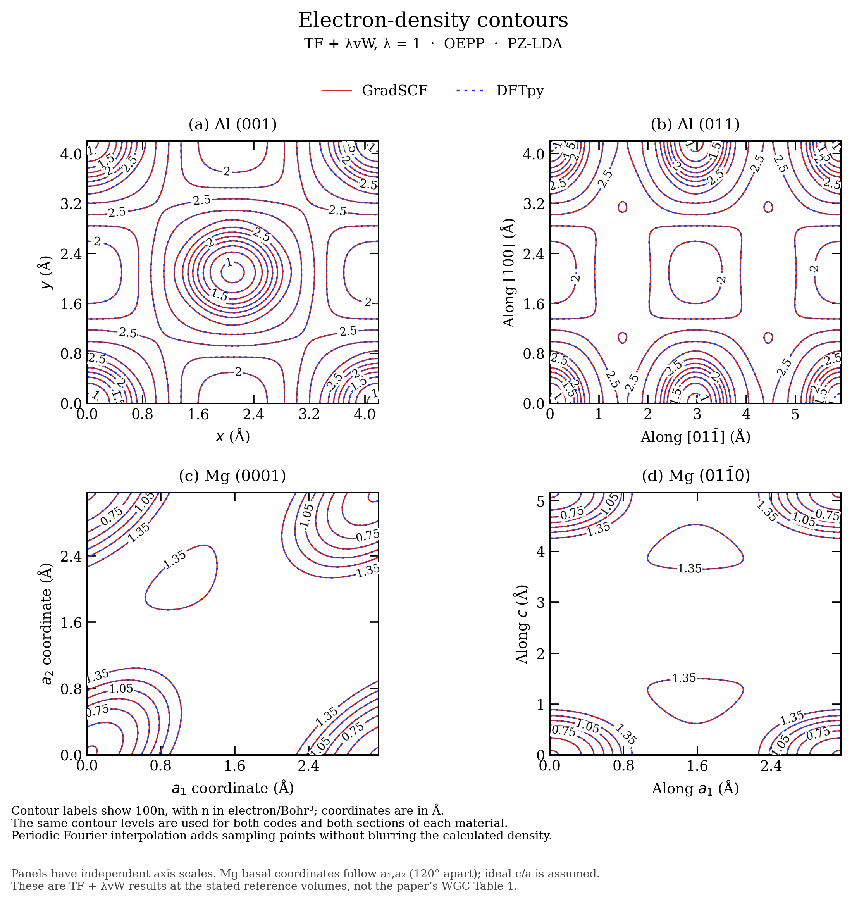
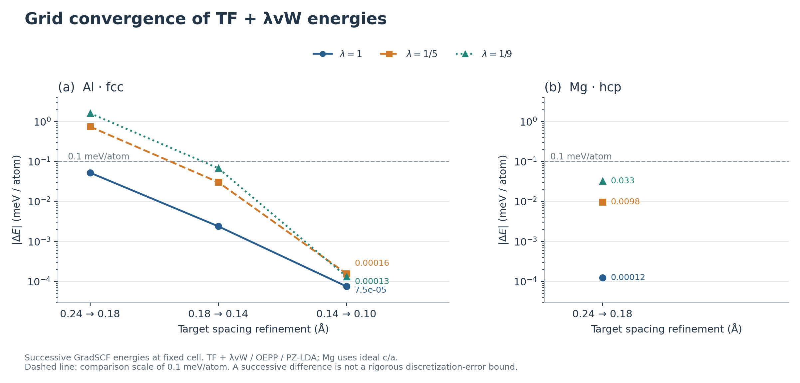
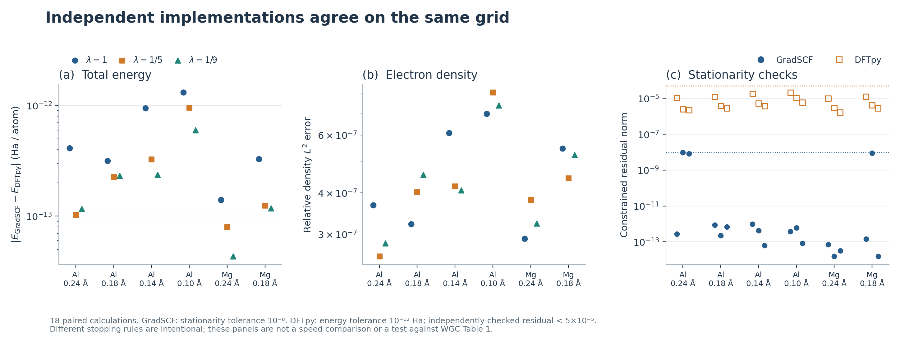
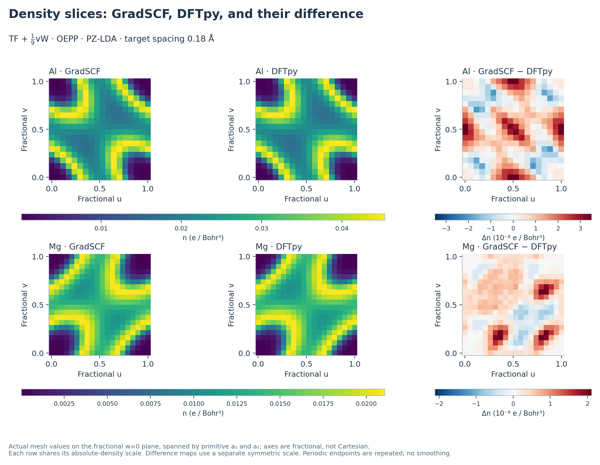
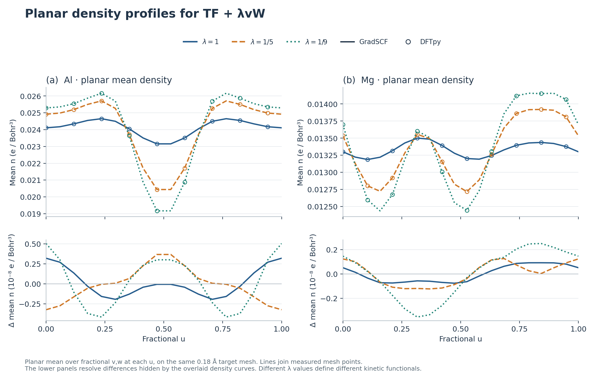

# OFDFT / DFTpy comparison figures

## WGC versus KS: the requested physical-method comparison

The new comparison uses GradSCF WGC99 and independent PySCF Gaussian KS,
with the same local OEPP and PZ-LDA. It follows the four sections in the
paper's Fig. 4. Exact CASTEP reproduction is not claimed; convergence changes
and the unresolved original Mg energy discrepancy are recorded in
[WGC_REPRODUCTION.md](WGC_REPRODUCTION.md).



[Vector PDF](figures/atlas_density_contours_wgc_ks.pdf).
Regenerate with `python examples/ofdft/plot_atlas_wgc.py`.

## Earlier TF + lambda vW regression figures

These figures use the measured outputs in [atlas_results.json](atlas_results.json)
and [atlas_density_slices.json](atlas_density_slices.json). The solid calculations
use TF + lambda vW, OEPP, and PZ-LDA. They are not the paper's WGC Table 1.
Structural assumptions, tolerances, units and reference-file provenance are in
[ATLAS_REPRODUCTION.md](ATLAS_REPRODUCTION.md).

## Paper-style crystallographic contours

Smooth 2x2 overlaid contours, matching the requested visual style: red solid
GradSCF and blue dotted DFTpy. The planes are Al (001)/(011) and Mg
(0001)/(01-bar-1-0). Positions are in Angstrom and contour labels show
100 times the density in electron/Bohr^3. The Mg basal panel uses oblique
a1/a2 coordinates (120 degrees apart), as explicitly labeled.



- [lambda=1 PDF](figures/atlas_density_contours_lambda_1.pdf)
- [lambda=1/5 PNG](figures/atlas_density_contours_lambda_1_5.png) / [PDF](figures/atlas_density_contours_lambda_1_5.pdf)
- [lambda=1/9 PNG](figures/atlas_density_contours_lambda_1_9.png) / [PDF](figures/atlas_density_contours_lambda_1_9.pdf)

The plot evaluates the original discrete periodic Fourier series on a 256x256
plane grid. It adds sampling points without filtering Fourier coefficients.
`atlas_density_volumes.npz` stores the six small paired reference volumes;
`plot_atlas_contours.py` creates these figures. A separate analytic oblique-cut
regression verifies the Fourier restriction and origin phase.

## Mesh convergence

Successive energy changes, in meV/atom. Al includes refinements to a 0.10 Å target
spacing; Mg includes the 0.24 → 0.18 Å check. The 0.1 meV/atom guide is a comparison
scale, not a rigorous complete-grid error bound.



[Vector PDF](figures/atlas_mesh_convergence.pdf)

## Independent code agreement

All 18 paired calculations, showing total-energy error, relative density error,
and independently checked stationarity. The two implementations use different
stopping criteria, as stated in the caption; this is not a timing comparison.



[Vector PDF](figures/atlas_code_agreement.pdf)

## Density slices

Actual grid samples at lambda=1/9 and target spacing 0.18 Å, on the fractional
w=0 plane spanned by primitive lattice vectors a1 and a2. The axes are fractional
coordinates; this is not labeled as a Cartesian (001) cut. Each material's two
absolute-density panels share one color scale, while the difference panel uses
a separately labeled symmetric scale in units of 10^-8 electron/Bohr^3.



[PDF](figures/atlas_density_slices.pdf)

## Density profiles

Planar averages over fractional v,w at fixed u for all three kinetic weights.
Solid/varied lines are GradSCF; open symbols are DFTpy. Lower panels show the
small differences obscured by the overlaid densities. Lines only connect actual
samples; the periodic endpoint is repeated without smoothing.



[Vector PDF](figures/atlas_density_profiles.pdf)

## Reproduce

```bash
# With DFTpy available, calculate the scalar report and sampled density planes.
PYTHONPATH=src:/path/to/DFTpy/src JAX_PLATFORMS=cpu \
  python examples/ofdft/atlas_compare.py

# Plot existing JSON outputs; no electronic-structure calculation is rerun.
MPLCONFIGDIR=/tmp/gradscf-mpl python examples/ofdft/plot_atlas.py
MPLCONFIGDIR=/tmp/gradscf-mpl python examples/ofdft/plot_atlas_contours.py
```

Summary PNG exports are 220 dpi; contour PNGs are 240 dpi. PDF text and lines are vector; the actual sampled
heatmaps are rasterized within PDF. Matplotlib and ASE are needed for plotting.
