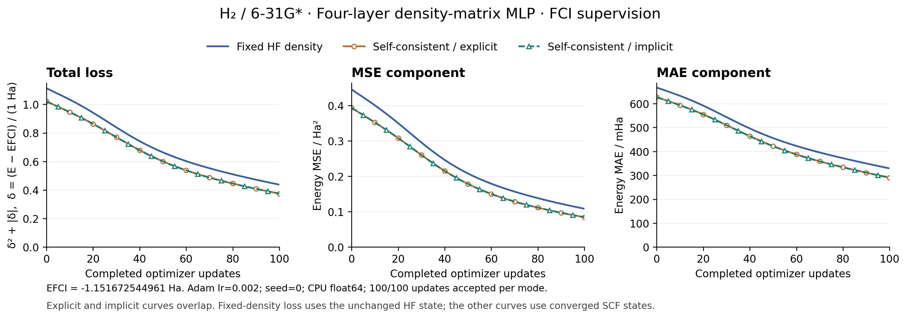

# H2 FCI-supervised training: 100 steps per mode



All runs use H2 at 0.74 Angstrom, Cartesian 6-31G*, the same initial GradSCF HF
state, and the same external MLP: flattened 4x4 AO density matrix -> 16 -> 16 ->
16 -> 1. Three hidden layers use tanh; the scalar output is scaled by 0.05 Ha.
The network predicts the entire XC energy without an added XC baseline.

Training uses Adam, learning rate 0.002, seed 0, CPU float64. There is one
geometry and one energy target. Loss is MSE + MAE with both weights equal to 1:

`delta = (E_predicted - E_FCI) / (1 Ha)`

`loss = delta**2 + abs(delta)`

FCI total energy: **-1.1516725449612413 Ha** (16 determinants, no frozen core).
GradSCF computes FCI with its own native-integral Hamiltonian. Independent
PySCF 2.9.0 calculations agree within 3.6e-15 Ha, including an independently
constructed AO-integral/HF calculation. The AO one-particle density agrees
within 8.9e-16. See `fci_reference_check.json`.

## Measured training losses

| Mode | Initial loss | Final MSE / Ha² | Final MAE / Ha | Final loss | Accepted updates |
|---|---:|---:|---:|---:|---:|
| fixed_density | 1.112662199201 | 0.108387442447 | 0.329222481686 | 0.437609924133 | 100 |
| explicit | 1.021108762032 | 0.084338520487 | 0.290410951046 | 0.374749471533 | 100 |
| implicit | 1.021108762032 | 0.084338520485 | 0.290410951042 | 0.374749471528 | 100 |

The CSVs contain 101 rows: initialization at step 0 and the losses after
updates 1...100. `next_update_accepted` describes the proposed update from
that row to the next. The step-100 row has no subsequent update. All 300
updates were accepted, all SCF evaluations in the two self-consistent histories
converged, and all three recorded loss curves decrease monotonically.
Maximum explicit/implicit loss difference over the entire history: 2.44e-11.

Fixed-density training evaluates at the unchanged initial HF density and
performs zero SCF cycles during training. The self-consistent modes evaluate
at each model's converged density, so they have a different step-0 loss despite
identical network parameters. FCI density is **diagnostic only**: using the
existing density-supervision term would request SCF even in fixed-density
configuration. We have not silently turned that run into SCF training.

## Interpretation and limits

After 100 steps, the self-consistent energy error is still about **0.29041 Ha**;
this demonstration has not reached FCI accuracy. The final error at the fixed
training density is 0.32922 Ha. No hyperparameter sweep, cherry-picked restart,
extra training steps, or best-iteration selection was used.

For a common post-training SCF diagnostic, the fixed-density-trained network
gives -0.864645929431 Ha (loss 0.369410893553); the self-consistently trained
networks give about -0.861261593917 Ha (loss 0.37474947153). Thus the displayed
training curves alone do not establish that SCF training is more accurate.
The corresponding grid-density relative L2 discrepancies from FCI are about
23.63% and 23.80%. Energy-only supervision at one geometry does not constrain
the XC potential or establish density accuracy or transferability.

Measurements: 2026-09-28, Apple M4 Pro, Python 3.12.2, JAX 0.8.1, CPU float64.
The rerun with the short Trainer API took 0.42 s / 1.66 s / 2.35 s for fixed /
explicit / implicit. They include JIT invocation but benefit from existing
compilation caches, exclude reference preparation and post-training diagnostics,
and are not a portable performance comparison. SCF and backward tolerances,
full energies and diagnostics are recorded in `summary.json`.

## Reproduce and inspect

```bash
PYTHONPATH=src JAX_PLATFORMS=cpu OMP_NUM_THREADS=1 \
  python examples/training/h2_fci_training.py
MPLCONFIGDIR=/tmp/gradscf-mpl python examples/training/plot_h2_fci_training.py
```

- `fixed_density.csv`, `explicit.csv`, `implicit.csv`: step-by-step loss components,
  energies, update acceptance and SCF convergence.
- `summary.json`: settings, timing and final common-SCF diagnostics.
- `reference.npz`: the FCI Hamiltonian, density, overlap and grid weights.
- `*_params.msgpack`: final network parameters after exactly 100 updates.
- `loss_curves.png` and `loss_curves.pdf`: plots of the recorded data, without
  smoothing or synthetic points.

The public mode label is now `explicit`. The short Trainer API was checked
against the previous 101-point CSV histories: total losses and predicted
energies are identical at every step; MSE roundoff changes are below 3e-17.
The SCF and derivative algorithms were not changed.

The examples now live in `examples/training/` and import `dft.Functional` and
root `training`, without importing the built-in neural XC model. After this
module relocation, another 100-step run per mode matches baseline `b5af8ed`
exactly for all loss components and energies (`layout_equivalence.json`).
Current per-loop timings are fixed_density: 0.38 s, explicit: 1.88 s, implicit: 2.37 s.
As above, compilation caches and host-side diagnostics make these timings
unsuitable as a portable speed comparison.
