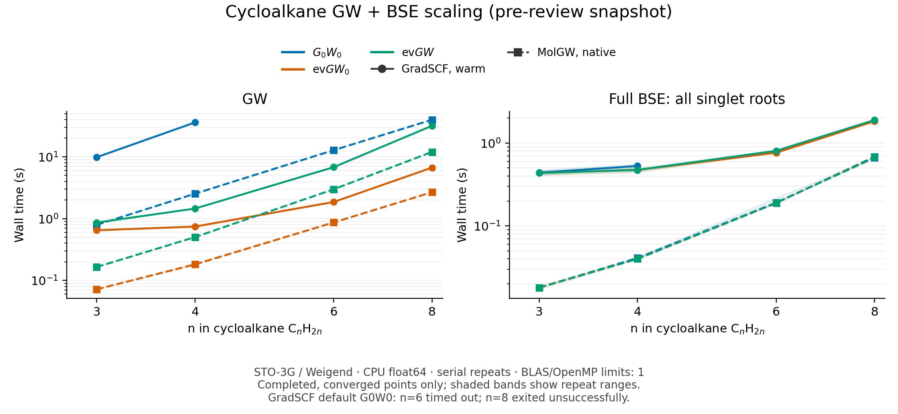

# GW + BSE scaling after resolvent reuse (2026-10-02)

**Pre-review timing snapshot.** The subsequent merge review corrected the
resolvent's finite-eta real-axis convention and restored residual guards on
cached Cholesky solves. These samples retain their original source hashes;
they are not timings of the final merged implementation. See
[the resolvent recheck](resolvent_reuse.md) for the final implementation.

This study measures forward calculations on archived cycloalkanes C3H6,
C4H8, C6H12, and C8H16. It does not time gradients or optimize production code.

## Protocol

- Apple M4 Pro, macOS arm64, JAX 0.8.1, Python 3.12.2, CPU float64.
  OMP_NUM_THREADS, OPENBLAS_NUM_THREADS, and VECLIB_MAXIMUM_THREADS are all 1.
  JAX runtime thread pools retain their defaults; this is not a verified
  single-thread JAX benchmark. All runs are serial.
- STO-3G Cartesian / Weigend RI; RHF tolerance 1e-10 Ha. Geometries and seed
  are in `geometries.json`. All MO QP targets, all G/W states, no frozen core.
- GradSCF uses 64 CD imaginary-axis points and eta=1e-5 Ha. evGW0 and evGW
  use the new resolvent implementation, tolerance 1e-7 Ha, maximum 40 cycles,
  and damping 0.3. G0W0 retains its public default auxiliary-space CD path.
- MolGW revision b831818d7a845c36f295d036dc8ceef59daf9991. Its existing
  comparison executable uses a 1e-10 RI cutoff and supplies QP screening
  energies for evGW BSE. G0W0 uses a 4001-point graphical scan with 0.0005 Ha
  spacing; evGW0/evGW execute 40 iterations. Their final changes are checked
  against 1e-7 Ha using the preceding iteration's printed spectrum.
- Both codes use dense **full singlet BSE**, including resonant/antiresonant
  coupling and every excitation. Screening is W0 for G0W0/evGW0 and W_QP
  for evGW. Dimensions are 108, 192, 432, and 768. This is a different,
  fully specified target from the older ten-root Davidson timing table.
- A fresh Python process is used for every size/method/engine. GradSCF runs
  RHF once, then constructs fresh GW and BSE objects three times on that
  source. Results are synchronized before stopping the clock. Warm times
  are the median of repeats 2 and 3; the first call is after RHF, not a
  claim of pure compilation time. Repeated spectra must agree to 1e-10 Ha.
- MolGW uses three fresh run directories. Tables show the median native
  `postscf` timer, not entire executable wall time. Full subprocess wall
  times are also archived. GW/BSE object preparation and native postscf
  timer boundaries differ slightly; these are practical workflow timings,
  not a language-only or identical-operation comparison. MolGW also does
  40 outer iterations while GradSCF stops at its residual criterion.
- A G0W0 case has a 240 s **whole-worker** budget for either code, including RHF and
  up to three GW+BSE repeats. A timeout is not a measured per-call GW time,
  a convergence failure, or evidence of OOM. Other cases have 300 s budgets.

## Incomplete default G0W0 cases

GradSCF C6H12 exceeded the 240 s worker budget without completing a GW+BSE
repeat. GradSCF C8H16 exited unsuccessfully after 191.24 s with an empty log,
also without a completed repeat. The initial outer runner did not preserve
that return code, and no contemporaneous Python/Jetsam diagnostic was found
in the checked diagnostic-report directories. The failure cause remains
undetermined: it is not labeled OOM, numerical divergence, or a GW timing.
These points are excluded from the plots and exponent fits.

## Completed timings

Values below are seconds, excluding RHF. All completed cases use the settings
above. Sizes run in ascending order, with evGW0, evGW, then G0W0; each
GradSCF case is followed by MolGW. Run order is not randomized.

| n | MO / auxiliary / transitions | Method | GradSCF GW warm | MolGW GW | GradSCF BSE warm | MolGW BSE |
|---:|:---|:---|---:|---:|---:|---:|
| 3 | 21 / 255 / 108 | g0w0 | 9.846 | 0.793 | 0.440 | 0.018 |
| 3 | 21 / 255 / 108 | evgw0 | 0.649 | 0.072 | 0.435 | 0.018 |
| 3 | 21 / 255 / 108 | evgw | 0.864 | 0.165 | 0.436 | 0.018 |
| 4 | 28 / 340 / 192 | g0w0 | 35.931 | 2.531 | 0.529 | 0.041 |
| 4 | 28 / 340 / 192 | evgw0 | 0.744 | 0.182 | 0.473 | 0.040 |
| 4 | 28 / 340 / 192 | evgw | 1.456 | 0.503 | 0.473 | 0.040 |
| 6 | 42 / 510 / 432 | g0w0 | timeout | 12.807 | timeout | 0.191 |
| 6 | 42 / 510 / 432 | evgw0 | 1.859 | 0.868 | 0.764 | 0.189 |
| 6 | 42 / 510 / 432 | evgw | 6.795 | 2.987 | 0.806 | 0.189 |
| 8 | 56 / 680 / 768 | g0w0 | failed | 39.703 | failed | 0.665 |
| 8 | 56 / 680 / 768 | evgw0 | 6.689 | 2.676 | 1.831 | 0.685 |
| 8 | 56 / 680 / 768 | evgw | 31.742 | 11.976 | 1.895 | 0.679 |

## First invocation versus warm GradSCF

| n | Method | First GW / s | Warm GW / s | First BSE / s | Warm BSE / s |
|---:|:---|---:|---:|---:|---:|
| 3 | g0w0 | 13.352 | 9.846 | 4.303 | 0.440 |
| 3 | evgw0 | 4.185 | 0.649 | 4.293 | 0.435 |
| 3 | evgw | 4.437 | 0.864 | 4.328 | 0.436 |
| 4 | g0w0 | 42.071 | 35.931 | 4.217 | 0.529 |
| 4 | evgw0 | 4.318 | 0.744 | 3.830 | 0.473 |
| 4 | evgw | 5.007 | 1.456 | 3.839 | 0.473 |
| 6 | evgw0 | 5.886 | 1.859 | 5.560 | 0.764 |
| 6 | evgw | 10.665 | 6.795 | 5.563 | 0.806 |
| 8 | evgw0 | 9.880 | 6.689 | 5.855 | 1.831 |
| 8 | evgw | 33.574 | 31.742 | 5.880 | 1.895 |



Both axes are logarithmic. Shaded bands show the range of the two warm GradSCF samples or three MolGW
samples. Missing points are not zero. Raw sample times, spectra, residuals,
software versions, and per-case commands are in `scaling_20261002.json`.

## Numerical checks

The following are maximum absolute errors against MolGW (Ha), including all
computed QP targets and the entire BSE spectrum, not only the lowest roots.

| n | Method | HF | QP | Full BSE |
|---:|:---|---:|---:|---:|
| 3 | g0w0 | 7.142e-10 | 6.238e-09 | 1.807e-08 |
| 3 | evgw0 | 7.142e-10 | 3.929e-08 | 6.501e-08 |
| 3 | evgw | 7.142e-10 | 9.897e-08 | 1.314e-07 |
| 4 | g0w0 | 1.423e-09 | 6.033e-09 | 2.087e-08 |
| 4 | evgw0 | 1.423e-09 | 3.928e-08 | 6.465e-08 |
| 4 | evgw | 1.423e-09 | 3.669e-08 | 6.376e-08 |
| 6 | evgw0 | 2.482e-09 | 3.965e-08 | 6.583e-08 |
| 6 | evgw | 2.482e-09 | 4.035e-08 | 6.913e-08 |
| 8 | evgw0 | 3.646e-09 | 4.922e-08 | 7.150e-08 |
| 8 | evgw | 3.646e-09 | 5.060e-08 | 7.476e-08 |

All completed GradSCF runs passed GW/BSE convergence flags and repeat-value
checks. MolGW must terminate normally, write all finite QP targets and all
expected BSE roots, and satisfy the outer-iteration check where applicable.
MolGW dense BSE does not report an iterative residual; the independent spectrum
comparison is retained rather than inventing a residual or convergence flag.
Agreement verifies the specified finite-basis algorithms, not experimental
accuracy or convergence with respect to orbital/auxiliary bases and quadrature.

## Empirical growth

Fits use `log(time) = p log(nMO) + constant` only when all four sizes completed.
They are descriptive finite-range exponents, not asymptotic complexity claims.
Fixed overhead, memory behavior, and different iteration counts affect them.

| Engine / method / stage | p |
|:---|---:|
| gradscf_evgw0_gw | 2.36 |
| gradscf_evgw0_bse | 1.42 |
| gradscf_evgw_gw | 3.69 |
| gradscf_evgw_bse | 1.47 |
| molgw_g0w0_gw | 3.99 |
| molgw_g0w0_bse | 3.70 |
| molgw_evgw0_gw | 3.71 |
| molgw_evgw0_bse | 3.73 |
| molgw_evgw_gw | 4.37 |
| molgw_evgw_bse | 3.72 |

## Reproduce

From the worktree root, run each size/method in a separate process, serially:

```sh
export PYTHONPATH=src JAX_PLATFORMS=cpu
export OMP_NUM_THREADS=1 OPENBLAS_NUM_THREADS=1 VECLIB_MAXIMUM_THREADS=1
python tests/comparisons/benchmark_cycloalkane_gw_bse.py \
  --engine gradscf --n 3 --method evgw0 --output /tmp/scaling/gradscf_n3_evgw0.json
export DYLD_LIBRARY_PATH=/private/tmp/libcint-molgw-build
python tests/comparisons/benchmark_cycloalkane_gw_bse.py \
  --engine molgw --n 3 --method evgw0 \
  --molgw /private/tmp/molgw-methane-20261001/driver/molgw_compare_full_rank \
  --output /tmp/scaling/molgw_n3_evgw0.json
```

Repeat with n=4,6,8 and methods g0w0,evgw0,evgw using fresh output directories.
The comparison executable and its build/adapter provenance are the same as
the methane reference under `../methane_aug_cc_pvdz/molgw/README.md`.
No production GW, BSE, or solver defaults were changed for this study.

To redraw the already archived data, run:

```sh
python examples/bse/plot_cycloalkane_scaling.py
```

This plot reads `scaling_20261002.json`; it does not discover or aggregate
new per-case files under `/tmp/scaling`. A new benchmark report must first
aggregate those outputs, retaining failures, settings, convergence checks,
and numerical comparisons. No aggregation command is provided here.

## Correction to the historical benchmark

The old MolGW ten-root Davidson setup on C3H6 hit its subspace limit with
residual approximately 0.21. Process exit status alone had accepted this
unconverged result. Its BSE times must not be used as a converged reference.
The current study uses dense full spectra for both codes and checks numerical
agreement. Historical cold/warm and larger-system resource claims are also
superseded; see the directory README.
