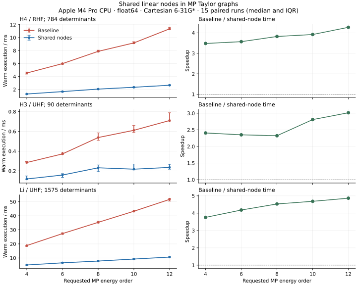

# Shared linear nodes in MP Taylor graphs

The residual/Taylor engine shares each expensive linear Hamiltonian action
across state lifting and energy extraction. It retains the same complete
excitation space, intermediate normalization, shared checked solves, Taylor
AD and public API. No MP4/MP5-specific formulas or independent solver are added.

## Mathematical transformation

For a fixed canonical HF frame, W=H-H0 is linear in the state. Write

\[
c(\lambda)=\sum_{j=0}^{k}\lambda^j c_j,\qquad
c_0=\Phi_0,\qquad u_j=Wc_j.
\]

Linearity gives

\[
Wc(\lambda)=\sum_{j=0}^{k}\lambda^j u_j,\qquad
[\lambda^n]\,\lambda Wc(\lambda)=u_{n-1}.
\]

Compute u0 once and append uj after solving for cj. The residual receives
the prepared Taylor coefficients of this linear node as its third input;
its remaining products and coefficient extraction still use JAX `jet`.

This does not omit the unknown Wc_n from the nth equation: multiplied by
lambda, it first enters degree n+1. The zero-point Jacobian remains
diag(Omega_exc,-1), with the same physical gaps and checked shared solver.

The energy graph uses the same nodes. For the partial state through k, prepare
the coefficients of H(lambda)c(lambda):

\[
h_0=H_0c_0,\qquad
h_j=H_0c_j+u_{j-1}\ (1\le j\le k),\qquad
h_{k+1}=u_k.
\]

Higher coefficients vanish for this partial state. Taylor AD of the generic
Rayleigh functional dot(c,h)/dot(c,c) produces the requested energies under
the unchanged Wigner 2k+1 contract. This also works when an explicitly requested
complete wavefunction order exceeds the energy order.

The main state/energy graph has k+1 distinct W actions. The SS/OS E2 diagnostics
retain two additional distinct projected-state actions. None of these actions
is placed inside Taylor propagation. Caching is local to each evaluation,
not a persistent numerical cache across changed integrals or model parameters.

## Outer derivatives

Every uj remains an ordinary differentiable JAX array:

\[
\frac{d u_j}{d\theta}
=\frac{dW}{d\theta}c_j+W\frac{dc_j}{d\theta}.
\]

No `stop_gradient` is applied. The prepared hj coefficients similarly retain
H0/gap and state response. The same guards reject invalid values and JVP/VJP.
This optimization changes graph representation; it introduces no physical
approximation, denominator shift, screening threshold or virtual truncation.

## Measured paired benchmark

Date: 2026-10-10. Apple M4 Pro, 12 logical CPUs, 24 GB RAM, macOS 26.6.2,
Python 3.12.2, JAX 0.8.1, CPU float64, native GradSCF HF and Cartesian 6-31G*.
H4 is neutral singlet RHF; H3 and Li are neutral doublet UHF. All electrons and
virtual MOs are retained. Coordinates and tolerances are in the runnable
[benchmark](../../../examples/mp/benchmark_taylor_graph.py).

Baseline source is read from Git commit
`5a0f242ea9573e89d56e5849ec5fc5392f8659fb`; it is not duplicated in production.
Optimized numerical source SHA256 is
`b0c4ca2b57333e0fa06344fc2f4e667fe1d926ec21d4a873aa153868f133f442`.

Both graphs use identical MO inputs. Timing excludes SCF, integral transforms,
connection construction, lowering and compilation. Each executable is compiled
and warmed first. Fifteen executions per variant are interleaved with alternating
execution order and explicit `block_until_ready`; tables report medians.
The benchmark measures compiled forward energy corrections, not backward
training or full workflow runtime. No other validation task was running during
the final paired measurement.

| System | Energy order | Determinants | Baseline / ms | Shared / ms | Speedup |
| --- | ---: | ---: | ---: | ---: | ---: |
| H4 | 4 | 784 | 4.541 | 1.304 | 3.48 |
| H4 | 6 | 784 | 5.993 | 1.678 | 3.57 |
| H4 | 8 | 784 | 7.887 | 2.063 | 3.82 |
| H4 | 10 | 784 | 9.190 | 2.344 | 3.92 |
| H4 | 12 | 784 | 11.361 | 2.659 | 4.27 |
| H3 | 4 | 90 | 0.285 | 0.118 | 2.41 |
| H3 | 6 | 90 | 0.372 | 0.158 | 2.35 |
| H3 | 8 | 90 | 0.538 | 0.232 | 2.32 |
| H3 | 10 | 90 | 0.611 | 0.218 | 2.81 |
| H3 | 12 | 90 | 0.710 | 0.236 | 3.01 |
| Li | 4 | 1575 | 18.823 | 5.010 | 3.76 |
| Li | 6 | 1575 | 27.338 | 6.538 | 4.18 |
| Li | 8 | 1575 | 35.339 | 7.799 | 4.53 |
| Li | 10 | 1575 | 43.235 | 9.230 | 4.68 |
| Li | 12 | 1575 | 51.666 | 10.623 | 4.86 |



The fixed spaces in these few-electron examples isolate order-dependent graph
cost. Both variants retain exactly the same determinants and virtual orbitals.
This is not an asymptotic molecular-size scaling benchmark or a GPU result.
Observed speedups span 2.32--4.86; both compiled timings still grow roughly
linearly with order. Source-level node reuse must not be advertised as removal
of the underlying combinatorial determinant-space growth.

Compiler cost diagnostics for MP12:

| System | Baseline estimated MFLOPs | Shared estimated MFLOPs | Baseline estimated MB accessed | Shared estimated MB accessed |
| --- | ---: | ---: | ---: | ---: |
| H4 | 36.960 | 5.695 | 427.029 | 65.115 |
| H3 | 1.740 | 0.585 | 17.641 | 4.618 |
| Li | 168.632 | 18.562 | 2010.768 | 261.779 |

These are XLA `cost_analysis` estimates, not measured hardware counters or
peak resident memory. They corroborate substantial elimination of repeated
linear coefficient propagation, but do not determine runtime speedup by themselves.

## Verification

Across all fifteen compiled order/system comparisons, maximum old/new correction
difference is 6.939e-18 Ha. Independent PySCF full-space Hamiltonian actions plus
the example-only NumPy RS recurrence also check every E2--E12 coefficient:

| System | Maximum independent-reference difference / Ha |
| --- | ---: |
| H4 | 5.855e-14 |
| H3 | 2.297e-13 |
| Li | 1.414e-15 |

The independent UHF H3 reference needs 85 HF cycles at these strict thresholds;
all reference calculations use max_cycle=200. Higher-order references are not
native PySCF MP12 APIs.

`tests/mp` passed **97 tests in 155.72 s** before four additional MP12 cases
were collected. Those added R/U tests separately passed **4 tests in 17.82 s**.
The suite includes a structural test that linear actions occur outside `jet`,
and new gradient/HVP finite differences with both integrals and Fock gaps varying.
The latter objective combines energy and output-coefficient norms solely to
check response paths; it defines no new physical model.

Read-only review also tested R/U nonlinear two-parameter perturbations, frozen
sectors and wavefunction orders larger than energy orders. Old/new returned
values and JVPs agreed exactly; VJP/HVP differences were below 3e-20. Existing
complete implicit-HF parameter-response tests remain passing.

Reproduce from the repository root with the native CPU library and PySCF/
matplotlib dependencies available:

```bash
PYTHONPATH=src JAX_PLATFORMS=cpu python -m pytest -q tests/mp
PYTHONPATH=src JAX_PLATFORMS=cpu MPLBACKEND=Agg python examples/mp/benchmark_taylor_graph.py
```

The benchmark saves raw paired samples, source hashes, compiler estimates and
independent-reference errors to ignored `artifacts/mp_graph/benchmark.json`,
plus PNG/SVG figures. It imports the historical kernel from Git for comparison;
ordinary GradSCF calculations use only the optimized production kernel.

## Relation to graph-based field-theory work

The [provided computational-graph paper](https://arxiv.org/html/2403.18840v2)
combines factorization of shared diagram structures with Taylor-mode propagation
and graph optimization. Here the transferable step is explicit sharing of a
linear operator node across Taylor degrees and the energy graph. We do not
implement that paper's diagram compiler, renormalization or Monte Carlo
integration, and its reported complexity reductions do not carry over as an
MP scaling claim. Larger molecules will still need a more efficient state/
operator representation, such as complete excitation-block tensor contractions.

See [SERIES.md](SERIES.md) for the physical residual and order-completeness proof.
